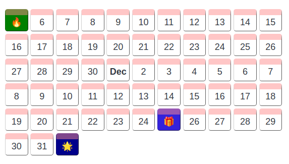

# Event Calendar Plugin for Joplin

This is a plugin for the [Joplin](https://joplinapp.org/) note-taking app.

It creates a calendar view of events that have been specified using the [YAML](https://yaml.org/) syntax within a fenced block.

- Organises events into "groupings"; you can group events by **day**, **week** or by **month**
- Focus is on readability and simplicity of content, which is why the **YAML** is simple in structure

###### Example Day view



## Features

- A grouping that contains no events will show the **date** (day grouping), **week number** (week grouping), or **month** (month grouping)
- If a grouping falls under the **current date**, it is highlighted in yellow
- Events can be specified in **any order**
- Events can be assigned an **icon** 🎁 such as an emoji

## How to use

Create a fenced block with the **codetype** `joplin-plugin-event-calendar`

### Example with one event

    ```joplin-plugin-event-calendar
    group: day
    events:
    - date: 2012-11-05
      icon: 🔥
      title: Bonfire night
      text: We have been collecting wood for a week now...
      bgColor: orange
    ```

Events are specified using the YAML syntax, with the following keys:

### group:
> Sets the grouping for the view
> - _**optional**_ 
> - **default** `day`
> - **accepts** : `day`, `week`, `month`, `d`, `w`, `m`

### events:
> Each individual event is a list with its own properties
>
> > **date:**
> > 
> > The date of the event
> > - **required**
> > - **accepts** : _yyyy-mm-dd_ or _mm-dd-yyyy_
>
> > **icon:**
> >
> > - **optional**
> > - **accepts** : _string_
> >
> > The icon for the event
>
> > **title**
> >
> > The title or heading of the event 
> > - **required**
> > - **accepts** : _string_
>
> > **text:**
> >
> > A more detailed description of the event
> > - **optional**
> > - **accepts** : _string_
>
> > **bgColor:**
> >
> > The background color for the event container
> > - **optional**
> > - **default** : random
> > - **accepts** : _string_

## Acknowledgements

This project was inspired by the [Joplin Life Calendar Plugin](https://github.com/hieuthi/joplin-plugin-life-calendar)
