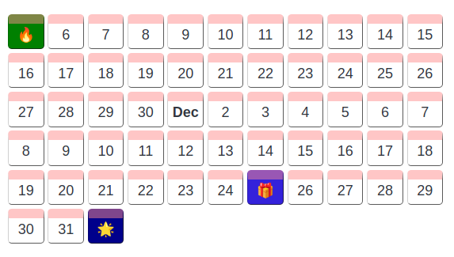

# Event Calendar Plugin for Joplin

This plugin creates a calendar view of events that have been specified using the [YAML](https://yaml.org/)  syntax within a fenced block.



## About

- The main feature of this calendar is the ability to change the view; you can group events by day, week or by month
- Events do not have to placed in order
- There is no need to specify a start and end date; the calendar will automatically calibrate the view depending on the dates found in the events
- Focus is on readability and simplicity of content, which is why the YAML is simple in structure

## Usage

1. To setup the calendar, first create a fenced block with the text `joplin-plugin-event-calendar` as the identifier

2. Specify what type of _grouping_ you would like with the `group` key, `d` for **day**, `w` for **week**, `m` for **month**

    ```text
    group: d           # (optional) d / w /m
    ```

3. Specify each event with the `events` key

    ```text
    events:
    - date: yyyy-mm-dd  # (required)
      icon: 🙂          # (optional) event icon
      title: Ahoi       # (required) event title
      text: hoi         # (optional) additional event details
      bgColor: red      # (optional) if not specified, a random one will be assigned
    ```

## Example

    ```joplin-plugin-event-calendar
    group: d
    events:
    - date: 2012-11-05
      icon: 🔥
      title: Bonfire night
      text: We have been collecting wood for a week now...
      bgColor: orange
    - date: 2012-12-25
      icon: 🎁
      title: Time for a gift!
    - date: 2013-1-1
      icon: 🌟
      title: New year's day
    ```

## Acknowledgements

This project was inspired by the [Joplin Life Calendar Plugin](https://github.com/hieuthi/joplin-plugin-life-calendar)
